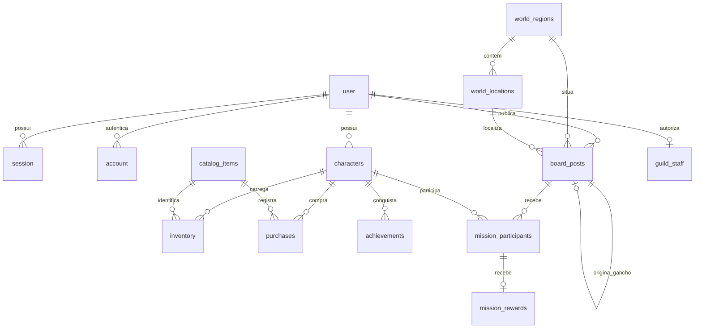

# Arquitetura e contratos

## Por que esta combinação

PostgreSQL oferece transações, locks de linha, constraints e relações fortes, úteis para
compras, propriedade de personagens e inscrições concorrentes. SQL explícito com `pg`
mantém migrations e regras de economia fáceis de auditar. JSONB se limita a atributos
da ficha e metadados da fonte; relações importantes são tabelas normalizadas.

Um monólito modular Node/Express reduz a complexidade inicial. React/Vite cuida da
interface. A versão empacotada serve `/api` e arquivos estáticos na mesma origem.
Better Auth fornece hashing de senhas, sessões, cookies e validações de autenticação.

## Modelo

As tabelas `user`, `session`, `account`, `verification` atendem ao core do Better Auth.
`world_entries` contém documentos narrativos agrupados por seção.
`schema_migrations` registra as migrations aplicadas. Não existe tabela `missions`;
`board_posts.kind = 'mission'` identifica uma missão.

## Regras transacionais de compra

1. Autenticar usuário, validar origem e payload.
2. `BEGIN`; buscar personagem por ID **e dono**, com `FOR UPDATE`.
3. Buscar `(character_id, idempotency_key)` já utilizado. Repetição com mesmo item/quantidade
   retorna a compra existente; payload diferente na mesma chave resulta em HTTP 409.
4. Ler item ativo e preço real no SQL, com `FOR SHARE`; validar saldo.
5. Debitar moedas, fazer upsert de quantidade no inventário e gravar compra/conquista.
6. `COMMIT`. Qualquer erro faz `ROLLBACK`.

O lock serializa gastos do mesmo personagem. Personagens diferentes podem comprar em
paralelo. Constraints impedem quantidades não positivas e saldo negativo. Estoque do
vendedor é ilimitado neste protótipo; controle de estoque exigirá uma relação adicional.
O frontend preserva a chave ao repetir uma solicitação que falhou sem resposta.

## Mural

- `open → active → completed`, ou `open/active → closed`.
- Mural mostra registros `open`/`active`; Missões mantém todos, incluindo histórico.
- Inscrições somente em missões `open`; chave composta evita inscrições duplicadas.
- A inscrição trava a postagem para não disputar com o início/encerramento.
- O autor altera status; postagens sem autor do seed são exemplos da guilda. Novas missões exigem `starts_at` futuro com fuso; PostgreSQL armazena `timestamptz` e a interface usa o horário local. O Início mostra missões abertas nas próximas 24 horas, sinalizando criador e inscritos. Atualização a cada minuto enquanto visível.
- Eventos e ganchos encerrados ficam no SQL, mas a interface não tem histórico específico
  para esses dois tipos nesta versão.
- Ouro anunciado não altera a carteira. XP é um total inteiro em `characters.experience`, sem mudança automática de nível.
- `/complete` trava a missão, verifica autoria/estado, exige resumo e uma recompensa (0 a 1.000.000 XP) para cada inscrito. Bloqueia personagens em ordem estável, credita XP, grava `mission_rewards`, conclui a missão e cria o gancho opcional, tudo na mesma transação. Repetições retornam 409 sem novo crédito; a chave composta do registro de recompensas também evita duplicação.
- A lista nominal dos inscritos é acessível apenas ao criador. Resultados individuais no mural são visíveis ao criador e ao dono do personagem; resumos e ganchos são compartilhados na guilda.
- Ganchos novos só surgem na conclusão e apontam para `source_mission_id`, único. A aba é somente leitura. O gancho legado de demonstração permanece em bancos existentes, sem vínculo inventado; não é criado em instalações novas.
- Eventos exigem role `staff`/`admin` em `guild_staff`, verificada na API, sem confiar no cliente nem no cadastro. Atribuição/revogação operacional pelo `npm run staff -- email role`. Nenhuma conta é promovida automaticamente.

## API

O atlas não duplica missões: `board_posts` tem `region_id` e `location_id` opcionais. O local pertence à região via chave estrangeira composta; IDs e coordenadas normalizadas dos locais vivem em `world_locations`. Ao receber `location_id`, o servidor resolve os nomes e a região, exige território disponível e ignora `region_id` arbitrário enviado pelo cliente. Local livre continua permitido. A migration vincula somente locais legados conhecidos por correspondência exata, preservando descrições e registros sem localização mapeável. Ganchos herdam os vínculos da missão concluída.

`WorldAtlas` apresenta os mesmos registros e cards do mural em uma lista lateral. Usa o mesmo `PostForm` e `/api/board`, mantendo o usuário no mapa após publicar. O Mundo permanece em Three.js; desde 23/09/2026 a visão interna do Reino do Norte usa `KingdomMap` e Canvas 2D: chão ilustrado, objetos em sprites de oito orientações e câmera com zoom, giro de 45° e arraste limitados. Os locais acessíveis acompanham a projeção e continuam abrindo os painéis existentes. A cena regional não depende de WebGL nem duplica dados de missões. Detalhes em [KINGDOM-2D.md](KINGDOM-2D.md). Nenhuma chamada a serviço geográfico externo é necessária.

Exceto `/api/health` e endpoints próprios de auth, todas as rotas exigem sessão.
Mutações de jogo exigem `Origin` presente e listado em `APP_ORIGIN`.

| Método | Rota | Função |
| --- | --- | --- |
| GET | `/api/health` | Disponibilidade real do banco |
| POST | `/api/auth/sign-up/email` | Cadastro Better Auth |
| POST | `/api/auth/sign-in/email` | Login Better Auth |
| POST | `/api/auth/sign-out` | Revogar sessão |
| GET | `/api/me` | Usuário atual |
| GET/POST | `/api/characters` | Listar/criar personagens do dono |
| GET | `/api/characters/:id/details` | Inventário, conquistas e 20 últimas compras |
| GET | `/api/catalog` | Equipamentos ativos |
| POST | `/api/purchases` | Comprar, com `character_id`, `item_id`, `quantity`, `idempotency_key` |
| GET/POST | `/api/board` | Listar/publicar registros no mural; GET aceita filtros opcionais `region_id` e `location_id`, POST aceita `location_id` |
| GET | `/api/atlas` | Regiões, disponibilidade, locais e coordenadas dos marcadores |
| POST | `/api/board/:id/join` | Inscrever `character_id` |
| PATCH | `/api/board/:id` | Alterar `status` pelo autor |
| GET | `/api/board/:id/participants` | Inscritos, somente para o criador da missão |
| POST | `/api/board/:id/complete` | Concluir com `summary`, `rewards: [{character_id, experience}]` e `hook?: {title, description}` |
| GET | `/api/world` | Conteúdo das seções narrativas |

Datas em ISO 8601; valores `*_cp` em cobre. Falhas retornam `{ error }`, opcionalmente
`details` de validação. 400: payload; 401: sessão; 403: origem; 404: registro não acessível;
409: conflito de saldo, idempotência ou status; 429: limite de solicitações.

## Segurança e operação

- Cookies HttpOnly/SameSite; `Secure` acompanha a URL HTTPS configurada no Better Auth.
- `BETTER_AUTH_SECRET` obrigatório, sem segredo padrão; SQL parametrizado; Zod na entrada.
- O servidor sobrescreve `x-guild-client-ip` com o IP do socket antes do Better Auth:
  um cliente não pode escolher o próprio IP de limitação. Sem confiança em proxy por padrão.
- Helmet e CSP; corpo limitado a 32 KB; respostas privadas com `Cache-Control: no-store`.
- Rate limits em memória adequados a uma única instância. Várias réplicas exigem store
  compartilhado e revisão da topologia/proxy. Não ativar `trust proxy` irrestritamente.
- Senhas são processadas pelo Better Auth; não há token de sessão em localStorage.
- Não habilitamos envio de e-mail nem recuperação de senha sem provedor configurado.
- Portas locais no Compose; publicação exige domínio/HTTPS, revisão de origens, credenciais,
  moderação de cadastro, backups e permissões de mestre/campanha.
- Atualizar a senha do `.env` não altera a senha de um banco já inicializado: mudanças
  precisam ser aplicadas também ao usuário PostgreSQL existente.
- Google Fonts é usado apenas como aprimoramento tipográfico; há fontes de fallback.
- Migrations/seeds automáticos são convenientes para este monólito. Em produção com
  múltiplas instâncias, separar a migração em uma etapa controlada de release.

## Decisões de implementação a preservar

Scripts CLI (`scripts/db-migrate.ts` / `db-seed.ts`) são separados dos módulos importáveis.
Não colocar detecção de entrypoint com `import.meta.url` dentro de módulos empacotados:
o bundler pode torná-los o mesmo arquivo do servidor e executar `pool.end()` indevidamente.

O override de `esbuild` em `package.json` mantém a versão >= 0.28.2, evitando uma falha
de leitura de arquivos no dev server Windows nas versões anteriores. O lockfile deve
ser versionado para instalações reproduzíveis.
